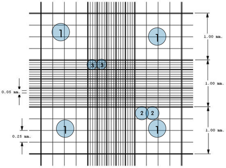
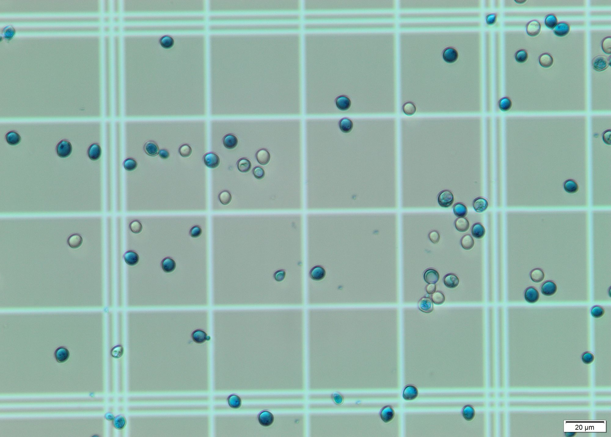
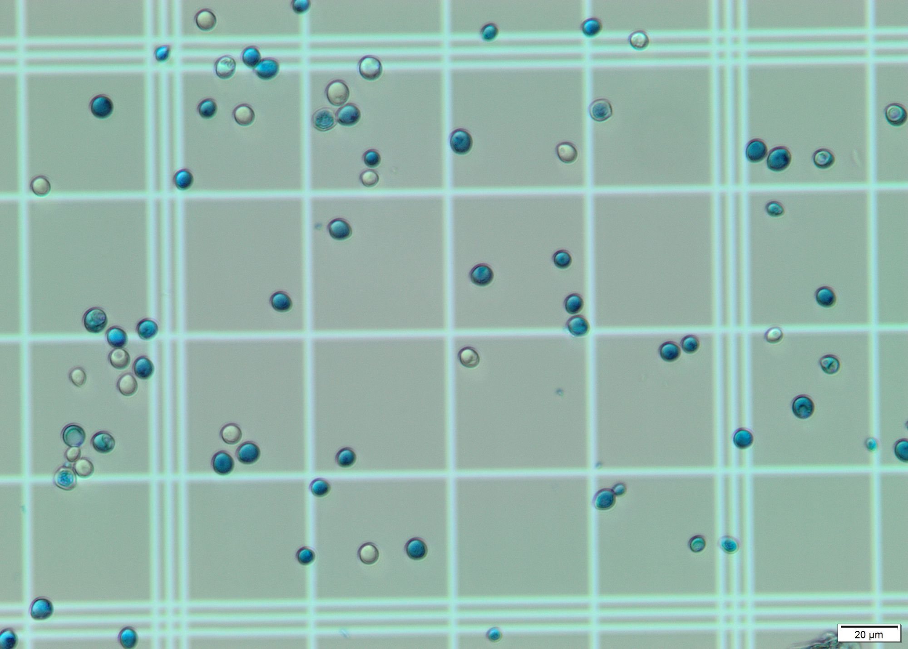
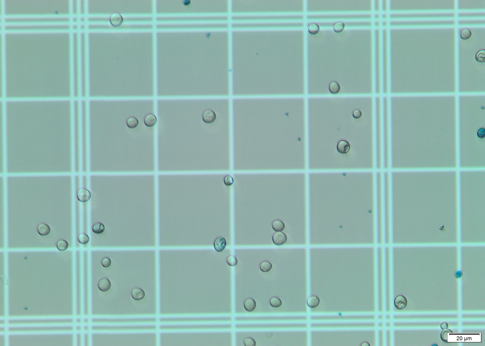
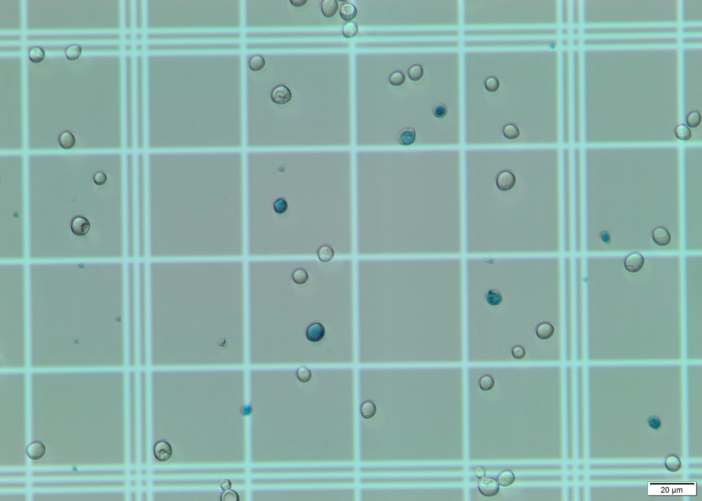
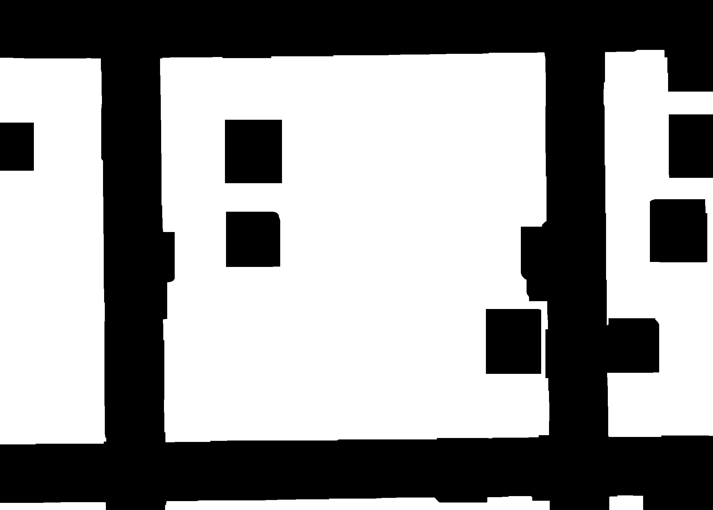
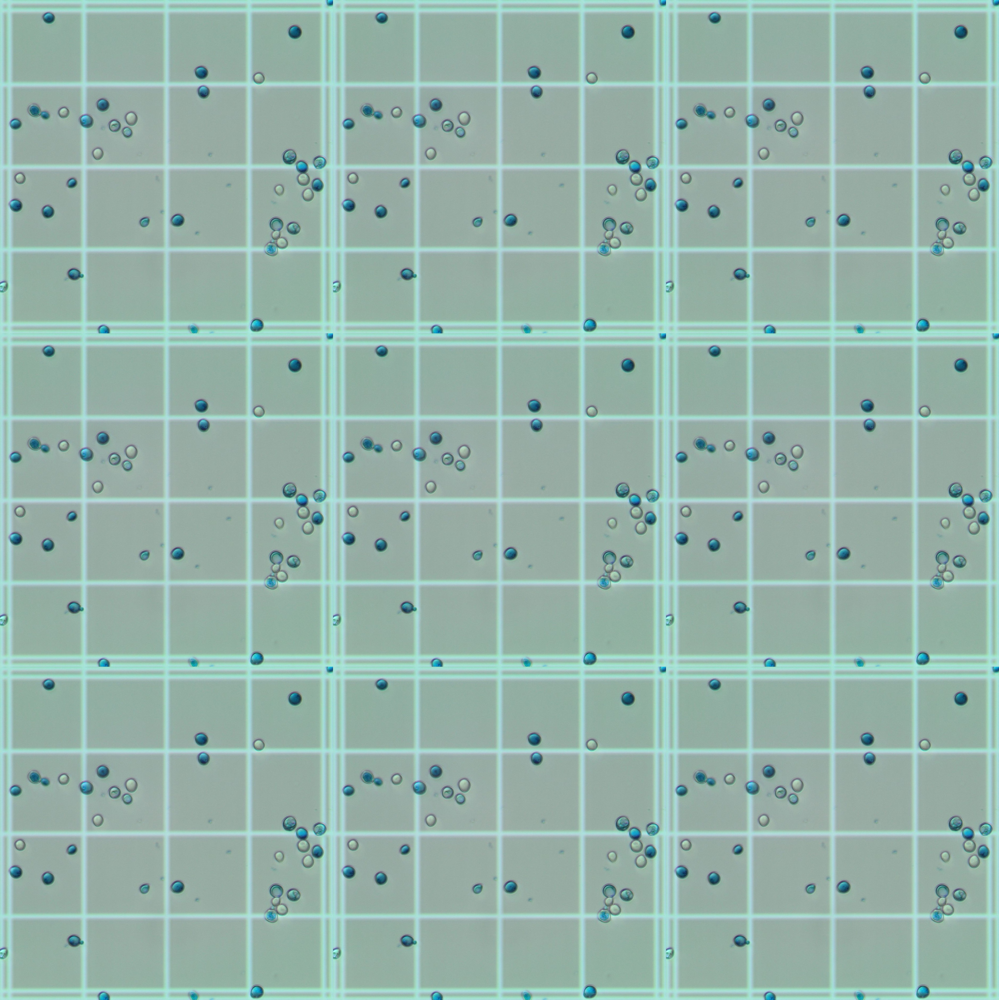

# Beer Challenge
Image Processing Beer Challenge proposed by Visio

More details from the Beer Challenge can be found [here](https://www.notion.so/Proposta-de-Projeto-336e8afb603447109116a61d147c0e09)

## Main objective
This project consists in the creation of a software for automatic counting of yeast cells in microscope images of fermentation samples.

## Input images
The sequence of input images corresponds to the central region of the Neubauer chamber, divided into NxM images, where N is the number of lines and M the number of columns. This NxM sequence must be reconstructed to form a single image.

### Neubauer chamber reference grid:

### Example input images:
All input images were gathered from the [Beer Challenge page](https://www.notion.so/Proposta-de-Projeto-336e8afb603447109116a61d147c0e09)

## Steps

### Grid reconstruction

Each image may have small rotations or areas that overlap with other input images that need to be considered when reconstructing the grid.
To reconstruct the grid, I try and get the biggest contour (grid pattern) on a processed image. Then I resize the contour and rotate the grid to get the output image. Finally, I put them together. Only the central part of the Neubauer chamber will be considered.
 (WIP) It is not possible yet to choose different images to compose the grid, considering the relatively small dataset

Here is an example of a morphed grid (1Quad.jpg)

And here is an example of a reconstructed grid (using only 1 dataset image - 1Quad.jpg)

### Cell identification

Identify cells in image. For this step I applied Hough transform on a grayscale blurred image. With the correct params it gives a pretty decent output, identifying almost all cells on the grid.
This [geeks for geeks article](https://www.geeksforgeeks.org/circle-detection-using-opencv-python/) was of much use.

### Differentiation of living and dead cells

In the images offered, the main visual difference is the coloration: The living cells are translucent/white, while the dead ones are bluish.
For this step I selected a region of interest (ROI) and calculated the most dominant color in the region using k-means and color masks for each circle found by the Hough transform.
All dead cells are properly identified due to their blue/cyan tone. However, some living cells are erroneously considered dead due to the color present in the grid, which shows through their "bodies".
These stackoverflow questions were of a big help [to detect the color of circles](https://stackoverflow.com/questions/56907198/what-is-the-best-way-to-detect-the-color-of-circles-detected-using-cv2-houghcirc) and [to choose the correct upper and lower hsv values](https://stackoverflow.com/questions/10948589/choosing-the-correct-upper-and-lower-hsv-boundaries-for-color-detection-withcv).

### Cell count

The total number of cells counted is equivalent to the number of circles found by the Hough transform. The total number of dead cells is equivalent to the number of cells identified as blue/cyan. The number of living cells is the difference between the former numbers.

## Expected output

Output contains four measurements and has the following format:

`TotalNumberOfCells NumberOfLivingCells NumberOfDeadCells %OfLivingCells`

There is also a way to visualize and differentiate living from dead cells: living cells are circled green and dead ones are circled red. There is also a text near then indicating either "dead" or "living".

Here is a visualization of the obtained result (using only 1 dataset image - 1Quad.jpg)

